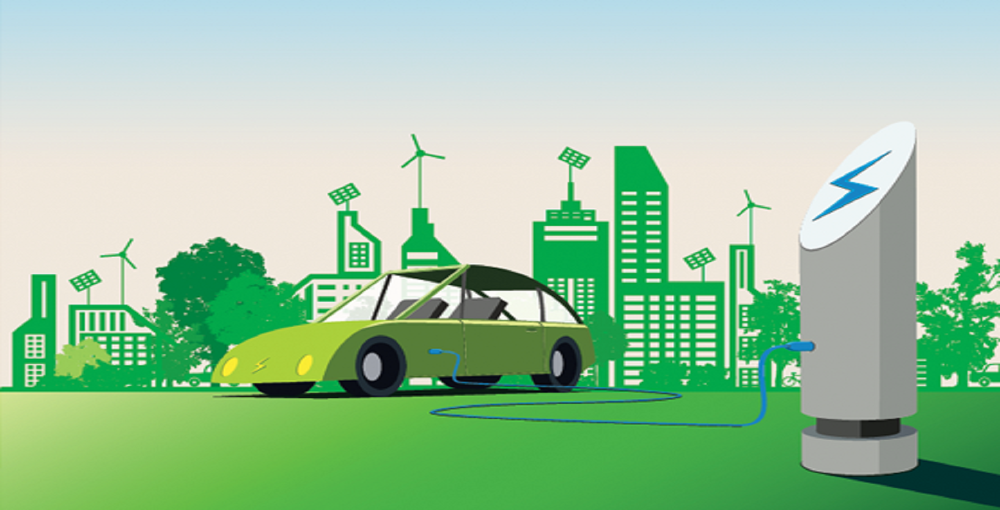
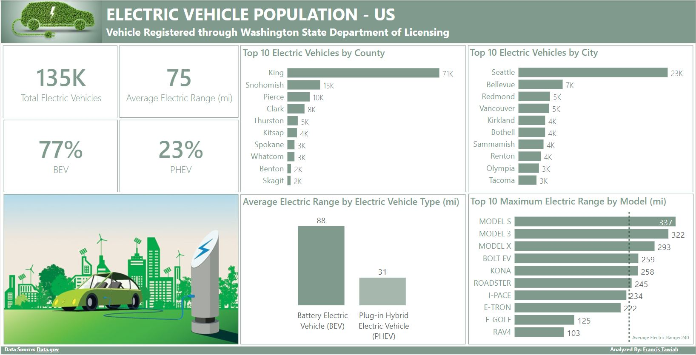
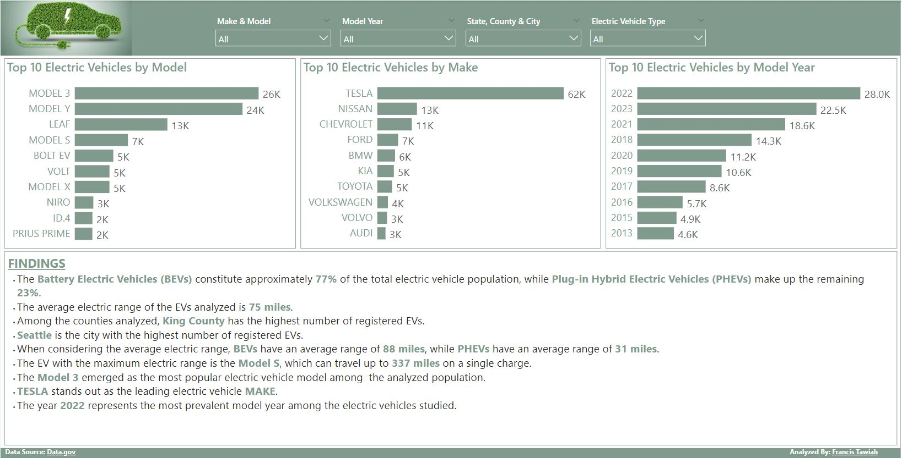

# Electric Vehicle Population Analysis

## Introduction

This is a Power Bi project on electric vehicle population. The project is to analyze and derive insights into the current state of the EV market. The project carefully examines a diverse population of electric vehicles, identifying key trends and preferences among consumers.

## Problem Statement

1. What is the total number of registered electric vehicles?
2. Which County and City has the highest number of registered electric vehicles?
3. What is the average electric range of the registered electric vehicles?
4. What is the average electric range of BEVs and PHEVs?
5. What is the percentage of Battery Electric Vehicles and Plug-in Hybrid Electric Vehicles?
6. Which model has the maximum electric range?
7. What is the most populated model?
8. Who is the leading electric vehicle maker?
9. Which year is the most prevalent electric vehicle model year?

## Skills/Concepts Demonstrated 

The following Power Bi features were incorporated:
- DAX
- Measures
- Tooltips
- Filters

## Modelling

No data was modelled since only the table was needed for the analysis.

## Visualization

The report comprises of 2 pages:
1. Main Page with the KPIs
2. A continuation page.

You can interact with the report [here](https://app.powerbi.com/groups/me/reports/a4068c1e-1114-40e7-bfc4-1753f3d0a878/ReportSection?experience=power-bi)

### Statistical Analysis                           
 

### Page Continuation

### Features:
- The background of this page was designed in Powerpoint and then imported into PowerBi.
- The Key Performance Indicators.
- An imported electric vehicle image.
- Statistical analysis of the data.
- Continuation of the Statistical analysis of the data.
- The findings from the analysis.

## Analysis 

#### What is the total number of registered electric vehicles?
- There are a total of **135,038** registered electric vehicles.

#### Which County and City has the highest number of registered electric vehicles?
- King County and Seattle had the highest number of registered electric vehicles.

#### What is the average electric range of the registered electric vehicles?
- The average electric range of the EVs is 75 miles.

#### What is the percentage of Battery Electric Vehicles and Plug-in Hybrid Electric Vehicles in the current market?
- Battery Electric Vehicles constitutes approximately **77%** of the total electric vehicles whiles the Plug-in Hybrid Electric Vehicles make up the remaining **23%**.

#### What is the average electric range of BEVs and PHEVs?
- BEVs have an average range of 88 miles, while PHEVs have an average range of 31 miles.

#### Which model has the maximum electric range?
- The EV with the maximum electric range is the Model S, which can travel up to 337 miles on a single charge.

#### What is the most populated model?
- The Model 3 emerged as the most popular electric vehicle model.

#### Who is the leading electric vehicle maker?
- TESLA stands out as the leading electric vehicle maker.

#### Which year is the most prevalent electric vehicle model year?
- The year 2022 represents the most prevalent electric vehicle model year.

## Conclusion
- The most consumed electric vehicle is the Model 3, the EV with the maximum electric range is Model S and the company with most consumed electric vehicles is TESLA.

## Data Sourcing
The data was sourced from [data.gov](https://catalog.data.gov/dataset/electric-vehicle-population-data).

  

